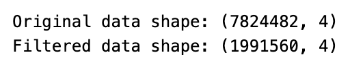
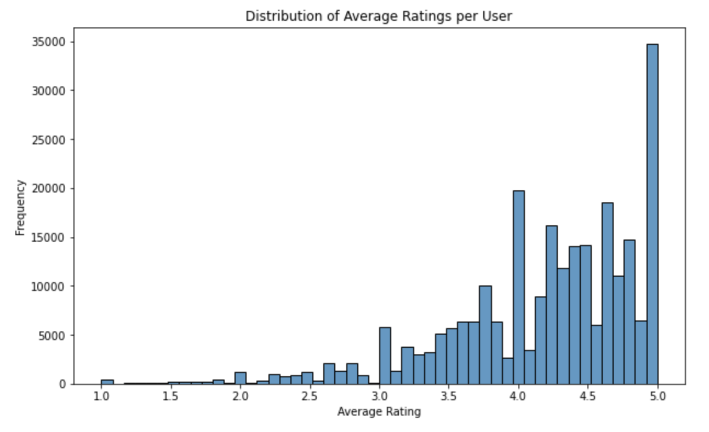
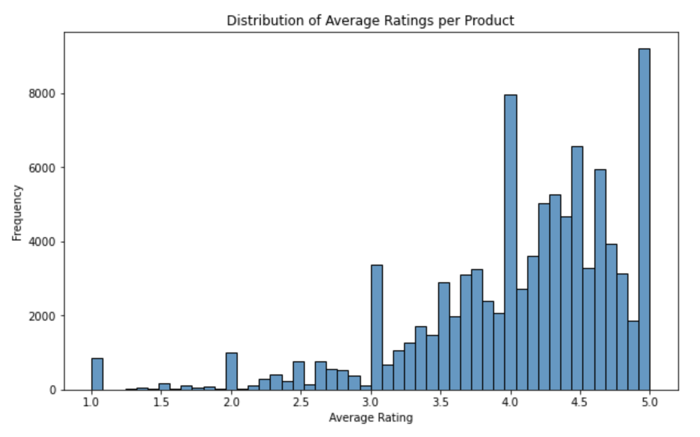
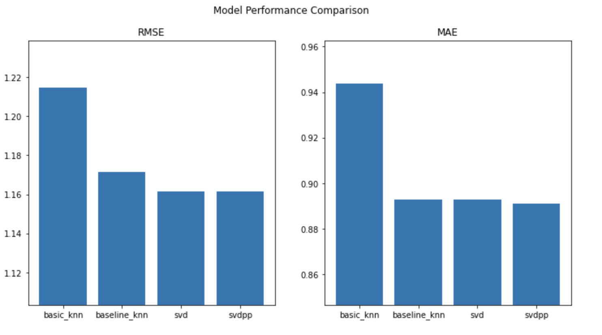

# Amazon Electronic Product Recommender System

Our goal is to create a sophisticated machine learning model to build an Amazon electronic product recommender system.

## Data Processing and Filtering

We perform basic data exploratory data analysis (EDA) and data filtering using the `data_processing.ipynb` notebook.

The filtered data is saved as `filtered_data.csv`.

**Data Filter:**

**Filtered Data Distribution:**

## Baseline Models Implementation

We implement several basic models, including SVD, SVD++, KNN, and KNN Baseline. The entire process can be found in `/baselinemodel/BaselineModels.ipynb`.

The training process includes grid search for optimizing hyperparameters and cross-validation for evaluating model performance.

**Baseline Model Performance:**

## LSTM Implementation

We implement lstm to take the timestamp feature in our dataset. The entire process can be found in `/lstm model/lstm.ipynb`.

**LSTM learning curve :**

## Neural Network Implementation

We've also implemented basic fully connect neural network. The entire process can be found in `/neural network model/neural_net.ipynb`.

**Neural Network learning curve :**
